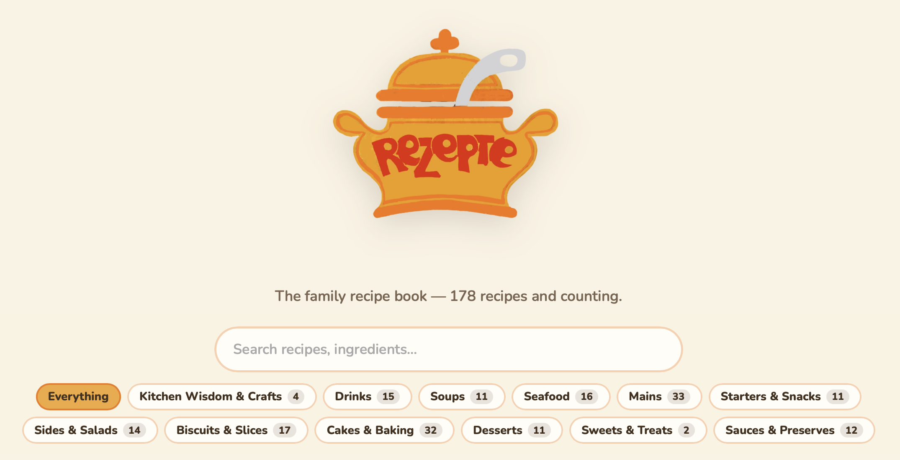

When I was a kid, and even when I was a bigger kid still living at home, Mum would pull out this little brown recipe book with dozens of handwritten recipes she had collected. It had an orange cooking pot on the cover, with the text “Rezepte”, which is German for recipes. My most recent memories of the book are of it being worse for wear, as you might imagine after at least 40 years of use (Mum says at least 50 years).

At the start of last year, for Mum’s birthday, I had the idea to surprise her with a website containing all of the recipes in the book. It was a good chance to see if I could vibe-code an entire website. Things were much different in January 2025. To vibe-code using ChatGPT, I had to copy and paste code from the app into my coding software. It took some effort, but I put the skeleton of the site together. Now I just needed the recipes.

But I immediately had a problem. I didn’t live with my parents and had no access to the book. I enlisted my Dad. He took a photo of every page.

I fed ChatGPT pages upon pages of images, which it did a decent job of pulling the text out of. Decent, but not perfect. There were errors everywhere, so each recipe needed to be verified. For this, I enlisted my two brothers.

I uploaded the images Dad took alongside the appropriate recipe page so that we could verify each recipe was correct. In most cases it wasn’t, and we certainly didn’t get around to verifying all 178 recipes. However, Mum’s birthday rolled around, and I was able to hand over a mostly complete, if slightly janky, website containing all her recipes.

But the story doesn’t end there. AI has come a long way since January 2025, with apps like Claude Code and Codex. It was time to go back and properly finish the website.

A year and a half later, I asked AI to go back through all 178 recipes and verify that they matched what was in the images, then completely redesign the site. It now has a ‘family login’, so we can continue to verify the recipes and add new ones too. It recategorised all the recipes into more obvious categories and added a ‘cooking mode’ for easy iPad use, with a single step on screen at a time and big buttons for messy fingers.

I registered the domain [rezepte.casa](https://www.rezepte.casa). It’s a mixture of German (Rezepte) and Italian, Spanish or Portuguese (casa). I like to think of the translation as “Recipes from home”.